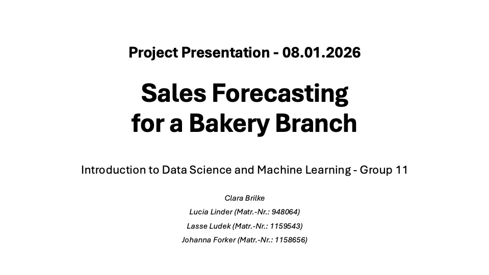

# 🥐 Bakery Sales Forecasting — Neural Network vs. Baseline

> Can machine learning predict daily bakery sales better than a simple trend line?  
> Spoiler: Yes — by ~40% on most product categories.


---

## ⚡ TL;DR

| Model | Avg. MAPE |
|---|---|
| Baseline (Linear Regression) | ~28% *(deine Zahl eintragen)* |
| **Neural Network** | **17.45%** ✅ |

Best category: **Rolls (10.2%)** — Most challenging: Seasonal Bread (53%) due to sparse data.

---

## 🎯 Business Problem

Bakeries face a daily trade-off: produce too much → waste, too little → lost revenue.  
This project builds a forecasting model for **6 product categories** over a 5-year horizon  
to support inventory and staffing decisions.

---

## 📊 Results by Category

*(Chart hier einfügen — Screenshot aus deinem Notebook)*

| Product | MAPE | Notes |
|---|---|---|
| Rolls | 10.2% | Most predictable — stable demand pattern |
| Cake | 13.5% | Strong weekend signal |
| Croissant | 15.6% | — |
| Bread | 17.8% | — |
| Confectionery | 24.5% | High variance, promo effects |
| Seasonal Bread | 53.1% | ⚠️ Limited training data for seasonal items |

---

## 🛠 Methodology

1. **EDA** — Identified weekly seasonality, holiday effects, and category-specific trends  
2. **Baseline** — Linear Regression to establish benchmark  
3. **Neural Network** — Multi-output Keras model, tuned on validation window  
4. **Evaluation** — MAPE per category on holdout period (Aug 2018 – Jul 2019)

---

## 💡 Key Learnings

- Weekly patterns dominate — day-of-week features were the strongest predictors  
- Seasonal Bread underperforms due to infrequent, irregular production cycles  
- A simple neural net outperforms linear regression without heavy feature engineering

---

## 🚀 Quick Start
```bash
pip install -r requirements.txt
jupyter notebook notebooks/3_Model/best_model_neural_net.ipynb
```

# Sales Forecasting for a Bakery Branch

## Repository Link

https://github.com/clarabri/bakery-sales-prediction 

## Description

This project focuses on sales forecasting for a bakery branch, utilizing historical sales data spanning from July 1, 2013, to July 30, 2018, to inform inventory and staffing decisions. We aim to predict future sales for six specific product categories: Bread, Rolls, Croissants, Confectionery, Cakes, and Seasonal Bread. Our methodology integrates statistical and machine learning techniques, beginning with a baseline linear regression model to identify fundamental trends, and progressing to a sophisticated neural network designed to discern more nuanced patterns and enhance forecast precision. The initiative encompasses data preparation, crafting bar charts with confidence intervals for visualization, and fine-tuning models to assess their performance on test data from August 1, 2018, to July 30, 2019, using the Mean Absolute Percentage Error (MAPE) metric for each product category.

### Task Type

Regression

### Results Summary

-   **Best Model:** Neural Net (s. 3_Model/best_model_neural_net.ipynb)
-   **Evaluation Metric:** MAPE: 17.45%
-   **Result by Category** (Identifier):
    -   **Bread** (1): 17.81%
    -   **Rolls** (2): 10.22%
    -   **Croissant** (3): 15.56%
    -   **Confectionery** (4): 24.53%
    -   **Cake** (5): 13.52%
    -   **Seasonal Bread** (6): 53.08%

    

## Documentation

1.  [**Data Import and Preparation**](0_DataPreparation/)
3.  [**Dataset Characteristics (Barcharts)**](1_DatasetCharacteristics/)
4.  [**Baseline Model**](2_BaselineModel/)
5.  [**Model Definition and Evaluation**](3_Model/)
6.  [**Presentation**](4_Presentation/Files_Presentation.pdf) 

## Cover Image


