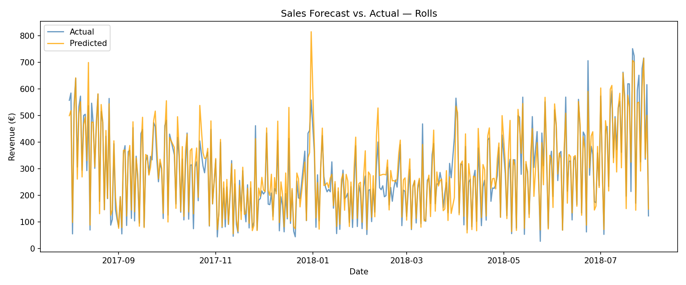

# 🥐 Bakery Sales Forecasting — Neural Network vs. Baseline

> Can machine learning predict daily bakery sales better than a simple trend line?  
> Spoiler: Yes — by ~48% on average. Results vary by category.


---

## TL;DR

| Model | MAPE |
|---|---|
| Baseline (Linear Regression) | 33.74% |
| **Neural Network** | **17.45%** |
| Improvement | ~48% |


- Best category: **Rolls (10.2%)** 
- Most challenging: **Seasonal Bread (53%)** due to sparse data.

---

## Business Problem

Bakeries face a daily trade-off: produce too much → waste, too little → lost revenue.  
This project builds a forecasting model for **6 product categories** over a 5-year horizon to support inventory and staffing decisions.

---

## Results by Category

| Product | MAPE | Notes |
|---|---|---|
| Rolls | 10.2% | Most predictable — stable demand pattern |
| Cake | 13.5% | Strong weekend signal |
| Croissant | 15.6% | — |
| Bread | 17.8% | — |
| Confectionery | 24.5% | High variance, promo effects |
| Seasonal Bread | 53.1% | Limited training data for seasonal items |



---

## Methodology

1. **EDA** — Identified weekly seasonality, holiday effects, and category-specific trends  
2. **Baseline** — Linear Regression to establish benchmark  
3. **Neural Network** — Keras Sequential model with BatchNormalization and Dropout, trained on validation window 
4. **Evaluation** — MAPE per category on holdout period (Aug 2018 – Jul 2019)

---

## Key Learnings

- Weekly patterns dominate — day-of-week features were the strongest predictors  
- Seasonal Bread underperforms due to infrequent, irregular production cycles  
- A simple neural net outperforms linear regression without heavy feature engineering

---

## Quick Start
```bash
pip install -r requirements.txt
jupyter notebook notebooks/3_Model/best_model_neural_net.ipynb
```
